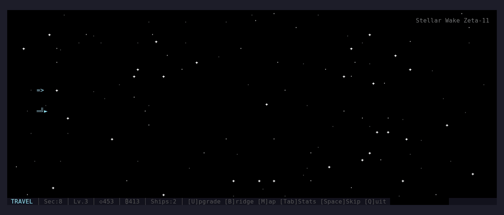

# Void Fleet

[](https://github.com/purpleneutral/voidfleet/actions)
[](LICENSE)

A space conquest idle TUI game built in Rust. Watch your fleet travel through space, battle enemies, raid planets, and grow stronger — all rendered as animated ASCII art in your terminal.

<!--  -->
<!-- Uncomment above after recording with: vhs demo.tape -->

## Features

- **Animated scenes** — parallax starfield, projectile combat, planet raids with tractor beams, all at 20fps in your terminal
- **Auto-cycling phases** — Travel → Battle → Raid → Loot, repeating with increasing difficulty
- **Fleet management** — 7 ship types from Scout to Capital Ship, each with unique sprites and special abilities
- **Ship abilities** — Bomber AOE blasts, Destroyer broadsides, Capital beam weapons, Carrier fighter launches
- **Smart AI** — enemies flank, focus fire, and retreat; your ships auto-dodge and protect formation
- **Pip companion** — a tiny robot buddy on your bridge that reacts to game events, needs feeding, and evolves visually
- **Upgrade system** — tech tree (lasers, shields, engines, beams), ship upgrades, Pip gifts
- **Sector map** — branching route choices with different risk/reward profiles
- **Travel events** — random encounters with meaningful choices (distress signals, wormholes, pirate ambushes)
- **Prestige system** — reset at sector 30+ for permanent bonuses
- **13 achievements** — from "First Blood" to "Admiral"
- **Adaptive difficulty** — rubber banding keeps it challenging but fair
- **Save/load** — game state persists to `~/.voidfleet/save.json`

## Install

```bash
# Clone and build
git clone https://github.com/purpleneutral/voidfleet.git
cd voidfleet
cargo build --release

# Run
./target/release/voidfleet

# Or install to PATH
cargo install --path .
```

Requires Rust 1.85+ (2024 edition).

## Controls

### Main Game
| Key | Action |
|-----|--------|
| `U` | Open upgrade screen |
| `B` | Visit bridge (Pip companion) |
| `M` | Open sector map |
| `Tab` | View stats |
| `Space` | Skip current phase |
| `S` | Manual save |
| `P` | Prestige (sector 30+) |
| `Q` / `Esc` | Quit (auto-saves) |

### Upgrade Screen
| Key | Action |
|-----|--------|
| `↑` / `↓` | Navigate items |
| `←` / `→` / `Tab` | Switch tabs (Ships / Tech / Fleet) |
| `Enter` | Buy or upgrade |
| `Esc` | Close |

### Bridge (Pip)
| Key | Action |
|-----|--------|
| `F` | Feed Pip (costs 10 scrap) |
| `P` | Pet Pip |
| `G` | Gift shop |
| `Esc` | Close |

### Travel Events
| Key | Action |
|-----|--------|
| `↑` / `↓` | Select option |
| `Enter` | Confirm choice |

## Game Loop

```
TRAVEL (45s) → ENCOUNTER → BATTLE (20s) or RAID (15s) → LOOT (4s) → repeat
```

- **Travel**: your fleet cruises through space, collecting scrap and encountering random events
- **Battle**: fleet combat with projectiles, explosions, and AI tactics
- **Raid**: harvest resources from planets with tractor beams while dodging turret fire
- **Loot**: rewards based on performance, sector difficulty, and bonuses

## Ship Types

| Type | Sprite | Unlock | Special |
|------|--------|--------|---------|
| Scout | `=>` | Start | Fast, reveals enemy HP |
| Fighter | `═╝►` | Lv.3 | High fire rate |
| Bomber | `═══►` | Lv.7 | AOE heavy payload |
| Frigate | `═══╗═╝►` | Lv.10 | Shield bubble |
| Destroyer | 3-line | Lv.18 | 5-projectile broadside |
| Capital | 3-line | Lv.30 | Devastating beam weapon |
| Carrier | 3-line | Lv.25 | Launches temporary fighters |

## Architecture

```
src/
  main.rs              — game loop, input, HUD
  state.rs             — game state, save/load
  engine/
    ship.rs            — ship types, stats, sprites
    combat.rs          — tech-aware damage calculations
    economy.rs         — loot, costs, catch-up mechanics
    procedural.rs      — enemy generation, adaptive difficulty
    achievements.rs    — achievement definitions and checking
  scenes/
    travel.rs          — starfield, fleet cruise, random events
    battle.rs          — combat simulation, AI, projectiles
    raid.rs            — planet surface, tractor beams
    loot.rs            — reward display
    title.rs           — title screen
    bridge.rs          — Pip companion
    upgrades.rs        — ship/tech upgrade shop
    stats.rs           — lifetime statistics
    map.rs             — sector route selection
  rendering/
    particles.rs       — particle system
    starfield.rs       — parallax background
    effects.rs         — screen transitions
    layout.rs          — shared UI utilities
```

## License

MIT — see [LICENSE](LICENSE).
